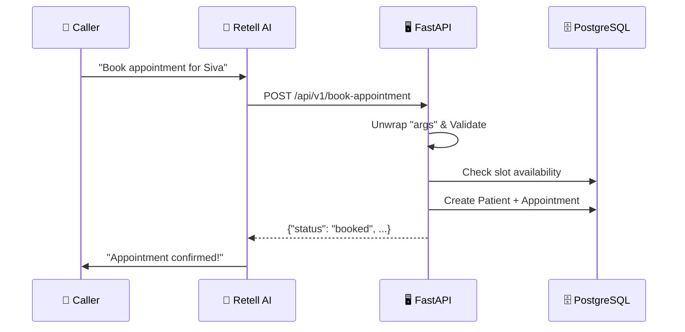
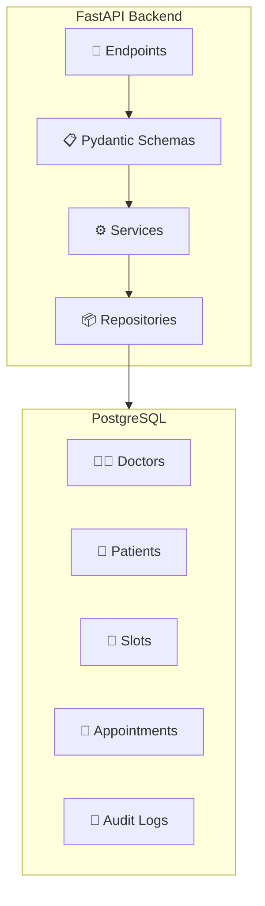
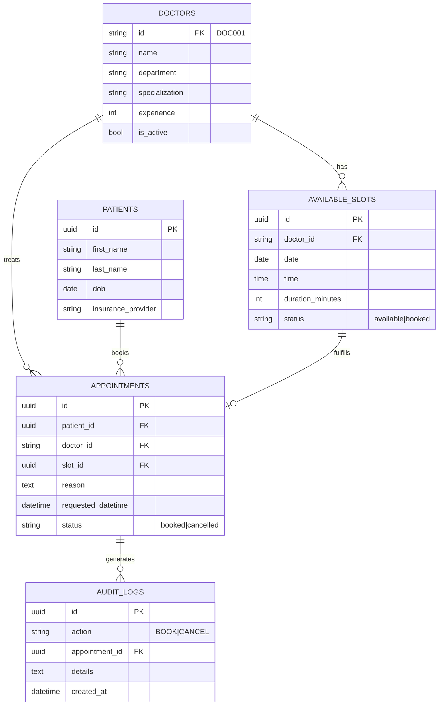
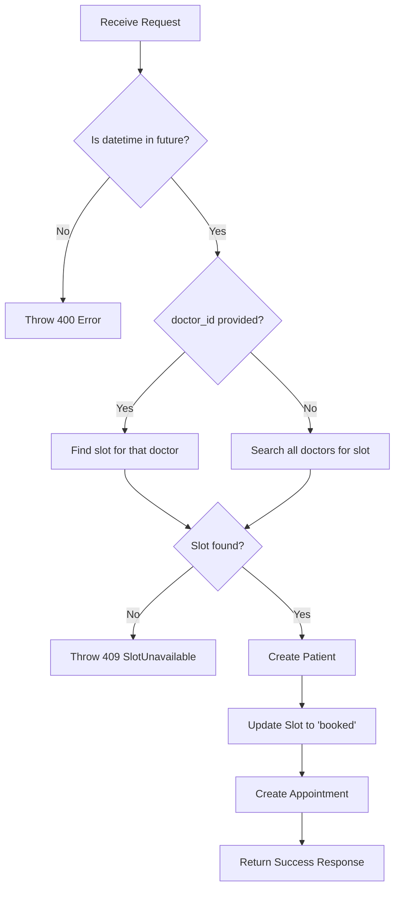

# Rainbow Maternity Clinic - Appointment Booking System

## Project Documentation

---

## 1. Project Overview

A **FastAPI-based REST API** for an AI-powered medical appointment booking system, integrated with **Retell AI** for voice-based interactions.

| Component | Technology |
|-----------|------------|
| Framework | FastAPI |
| Database | PostgreSQL (Render) |
| ORM | SQLAlchemy |
| Validation | Pydantic v2 |
| AI Integration | Retell AI |
| Hosting | Render |

---

## 2. Architecture

### End-to-End Flow



### System Components



---

## 3. Project Structure

```
PythonProject/
├── main.py                    # Entry point (uvicorn)
├── app/
│   ├── main.py               # FastAPI app initialization
│   ├── core/
│   │   └── config.py         # Settings (DATABASE_URL, etc.)
│   ├── db/
│   │   └── session.py        # SQLAlchemy engine & session
│   ├── models/
│   │   └── models.py         # SQLAlchemy ORM models
│   ├── schemas/
│   │   └── schemas.py        # Pydantic request/response models
│   ├── api/v1/
│   │   ├── api.py            # Router aggregation
│   │   └── endpoints/
│   │       ├── appointments.py
│   │       ├── doctors.py
│   │       └── patients.py
│   ├── services/
│   │   ├── appointment_service.py
│   │   ├── doctor_service.py
│   │   └── patient_service.py
│   ├── repositories/
│   │   ├── appointment.py
│   │   ├── available_slot.py
│   │   ├── doctor.py
│   │   ├── patient.py
│   │   └── audit_log.py
│   └── exceptions/
│       ├── custom.py         # Domain exceptions
│       └── handlers.py       # Global exception handlers
├── alembic/                  # Database migrations
├── scripts/                  # Utility scripts
└── pyproject.toml           # Dependencies
```

---

## 4. Database Models

### Entity Relationship Diagram



### Model Details

| Model | Table | Key Fields |
|-------|-------|------------|
| `Doctor` | `doctors` | `id`, `name`, `department`, `specialization`, `experience` |
| `Patient` | `patients` | `id`, `first_name`, `last_name`, `dob`, `insurance_provider` |
| `AvailableSlot` | `available_slots` | `id`, `doctor_id`, `date`, `time`, `status` |
| `Appointment` | `appointments` | `id`, `patient_id`, `doctor_id`, `slot_id`, `reason`, `status` |
| `AuditLog` | `audit_logs` | `id`, `action`, `appointment_id`, `details` |

---

## 5. API Endpoints

### Base URL: `/api/v1`

### Appointments

| Method | Endpoint | Description |
|--------|----------|-------------|
| `POST` | `/book-appointment` | Book a new appointment |
| `POST` | `/cancel-appointment` | Cancel an existing appointment |
| `GET` | `/appointments` | List all booked appointments |
| `GET` | `/appointments/{id}` | Get appointment by ID |

### Doctors

| Method | Endpoint | Description |
|--------|----------|-------------|
| `GET` | `/doctors` | List all doctors (with optional slots) |
| `GET` | `/doctors/{id}` | Get doctor details + available slots |
| `GET` | `/available-slots` | Get slots by department filter |

---

## 6. Pydantic Schemas

### AppointmentRequest (Input)

```python
class AppointmentRequest(BaseModel):
    doctor_id: Optional[str] = None
    first_name: str
    last_name: str
    dob: str                    # YYYY-MM-DD
    insurance_provider: str
    reason: str
    requested_datetime: str     # ISO 8601

    # Validators
    @field_validator("dob")      # Validates date format
    @field_validator("requested_datetime")  # Validates datetime
    @model_validator(mode='before')  # Unwraps Retell "args"
```

### JSON Schema (for Retell AI)

```json
{
  "type": "object",
  "required": ["first_name", "last_name", "dob", 
               "insurance_provider", "reason", "requested_datetime"],
  "properties": {
    "first_name": {"type": "string", "description": "Patient first name"},
    "last_name": {"type": "string", "description": "Patient last name"},
    "dob": {"type": "string", "description": "Date of birth (YYYY-MM-DD)"},
    "insurance_provider": {"type": "string", "description": "Insurance provider"},
    "reason": {"type": "string", "description": "Reason for visit"},
    "requested_datetime": {"type": "string", "description": "ISO 8601 datetime"},
    "doctor_id": {"type": "string", "description": "Optional doctor ID"}
  }
}
```

---

## 7. Service Layer Logic

### AppointmentService.book_appointment()



### Key Business Rules

1. **Past Date Validation** - Rejects appointments in the past
2. **Slot Availability** - Only books available slots
3. **Auto Patient Creation** - Creates patient record on each booking
4. **Atomic Transaction** - Slot update + appointment creation in one transaction

---

## 8. Exception Handling

### Custom Exceptions

| Exception | Status | Message |
|-----------|--------|---------|
| `AppError` | 400 | Base application error |
| `SlotUnavailableException` | 409 | "That slot is no longer available..." |
| `AppointmentNotFoundException` | 404 | "Appointment not found" |
| `PatientNotFoundException` | 404 | "Patient not found" |

### Validation Error Handler

Converts Pydantic validation errors to conversational messages:
```
"I'm sorry, but I seem to be missing some information. The 'first_name' is missing."
```

---

## 9. Retell AI Integration

### Payload Handling

Retell sends data wrapped in `args`:
```json
{
  "args": {
    "first_name": "Siva",
    "last_name": "Reddy",
    ...
  },
  "name": "book-appointment"
}
```

The `model_validator` automatically unwraps this:
```python
@model_validator(mode='before')
def unwrap_retell_args(cls, data):
    if isinstance(data, dict) and "args" in data:
        return data["args"]
    return data
```

---

## 10. Running the Project

### Local Development

```bash
# Install dependencies
pip install -e .

# Run with hot-reload
python main.py
# Server runs at http://localhost:8000
```

### Environment Variables

| Variable | Description |
|----------|-------------|
| `DATABASE_URL` | PostgreSQL connection string |

### Database Migrations

```bash
alembic upgrade head
```

---

## 11. Example API Calls

### Book Appointment

```bash
curl -X POST "http://localhost:8000/api/v1/book-appointment" \
  -H "Content-Type: application/json" \
  -d '{
    "first_name": "Siva",
    "last_name": "Reddy",
    "dob": "1987-06-10",
    "insurance_provider": "MediBuddy",
    "reason": "Pediatric care",
    "requested_datetime": "2026-01-20T09:30:00",
    "doctor_id": "DOC003"
  }'
```

### Response (Success)

```json
{
  "status": "booked",
  "appointment": {
    "id": "a1b2c3d4-...",
    "doctor_id": "DOC003",
    "patient": {
      "first_name": "Siva",
      "last_name": "Reddy"
    },
    "requested_datetime": "2026-01-20 09:30:00"
  }
}
```

### Get Available Doctors

```bash
curl "http://localhost:8000/api/v1/doctors?include_slots=true&slot_limit=5"
```

---

## 12. Deployment (Render)

1. Push code to GitHub
2. Render auto-deploys from `code_optimization` branch
3. Uses `Dockerfile` for containerization
4. PostgreSQL database hosted on Render

---

*Documentation generated on 2026-01-17*
